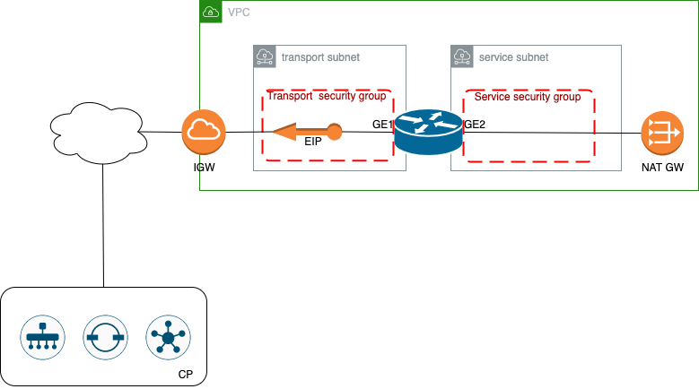

# Catalyst 8000v deployment on Amazon AWS

Deployment of the c8kv on AWS with basic configuration and onboarding in the SDWAN CP



## Overview

The scripts will deploy and onboard a Catalyst 8000V in an existing AWS VPC. Following items will be created:
- C8000v instance with a transport interface and a service interface. Basic configuration to connect to an existing SD-WAN Fabric. 
- Security groups for the 2 different subnets/interfaces
- Public IP address for the C8000 transport interface

In case needed, the scripts in the vpc folder can be used to create the needed vpc and subnets:
- VPC, routing table, IGW and NATGW
- Transport subnet - used to connect to SD-WAN controllers
- Service subnet - used to connect to application VNETs

Depending on the requirements, the 2 set of scripts can also be combined to create the vpc and deploy the c8kv on one run.


## Terraform - Authenticating to AWS

AWS authentication details like credentials file and selected profile need to be specified into aws/aws.tf
(see [AWS credentials](https://docs.aws.amazon.com/cli/latest/userguide/cli-configure-files.html) for details)

## Create c8000v in a specific VPC

The VPC where it will be deployed as well the 2 needed subnets are expected to already exist - including the routing table, an IGW and NATGW. 

Deploy Cisco SD-WAN C8000v in the VNET:
- Go to cedge directory
- Edit variables.auto.tfvars.json with appropriate settings.

The complete list of input variables:
- name: common prefix for resource names
- region: AWS region
- vpc_id: an exisitng vpc id (If created with the provided scripts, take the value from the vpc scripts output)
- subnet_transport: name of the subnet to be used for the transport interface (If created with the provided scripts, take the value from the vpc scripts output)
- subnet_service: name of the subnet to be used for the service interface   (If created with the provided scripts, take the value from the vpc scripts output)
- image_id: AMI id for the c8000v (region specific)
- instance_type: type of AWS instance to be deployed (eg. c5n.large)

Terraform deployment.
```
$ terraform init
$ terraform plan
$ terraform apply
```


## Create VPC

If needed and not reusing existing, deploy AWS VPC for Cisco SD-WAN C8000v: 
- Go to vpc directory
- Edit vpc/variables.auto.tfvars.json with your VPC Name, region, availability zone.
For subnet_name_prefix, VPC address space and subnet prefixes there are default values already specified in the input.tf file. Feel free to specify custom values in the variables.auto.tfvars.json or leave the defaults

The complete list of input variables:
- name: name of the vpc
- region: AWS region
- availability_zone: AWS region availability zone
- subnet_name_prefix: prefix to be used on naming the subnets (<subnet_name_prefix>-transport and <subnet_name_prefix>-service)
- address_space:   vpc address space
- subnet_transport_prefix: CIDR prefix of the transport subnet
- subnet_service_prefix: CIDR prefix of the service subnet


With vpc as your current working directory, run terraform.
```
$ terraform init
$ terraform plan
$ terraform apply
```
The vpc id and the subnet names will be displayed at the end of running the scripts. 


## Termination

To terminate c8000v instances, go to the cedge directory and run:
```
$ terraform destroy --auto-approve
```

To destroy the empty VPC, go to the vpc directory and run:
```
$ terraform destroy --auto-approve
```


