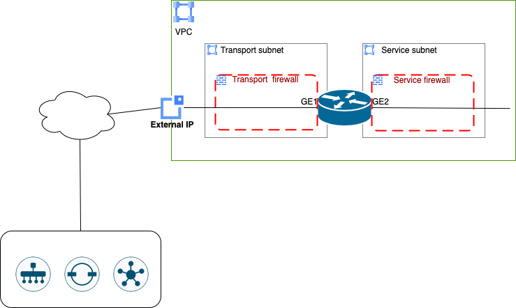

# Catalyst 8000v deployment on Google Cloud Platform

Deployment of the c8kv on GCP with basic onfiguration and onboarding in the SDWAN CP

The scripts will deploy and onboard a Catalyst 8000V in an existing GCP VPC network. Following items will be created:

- C8000v instance with a transport interface and a service interface. Basic configuration to connect to an existing SD-WAN Fabric.
- Firewalls for the 2 different subnets/interfaces
- Public IP address for the C8000 transport interface

In case needed, the scripts in the vpc folder will create the needed vpc and subnets:

- Transport network/subnet
- Service network/subnet

Depending on the requirements, the 2 set of scripts can also be combined to create the vpc networks and deploy the c8kv on one run.

## Terraform - Authenticating to GCP

Please refer to [Generate Credentials JSON](https://registry.terraform.io/providers/hashicorp/google/latest/docs/guides/getting_started#adding-credentials) in order to create the json file to be used for authentication.
Then specify the path to the generated JSON file in gcp/gcp.tf

## Create c8000v in a specific VPC

The VPC where it will be deployed as well the 2 needed subnets are expected to already exist. Also be sure to have the necessary cloud-init file under the cloud-init directory - use the provided ansible script under GenerateCloudInit to generate it.

Deploy Cisco SD-WAN C8000v in the VPC network:

- Go to cedge directory
- Edit variables.auto.tfvars.json with appropriate settings.

The complete list of input variables:

- name: name of the deployed instance
- region: GCP region
- zone: GCP zone
- subnet_transport: name of the subnet to be used for the transport interface (If created with the provided scripts, take the value from the vpc scripts output)
- subnet_service: name of the subnet to be used for the service interface   (If created with the provided scripts, take the value from the vpc scripts output)
- image_id: id for the c8000v (region specific)
- instance_type: type of GCP instance to be deployed (eg. n1-standard-4)

Terraform deployment:

    terraform init
    terraform plan
    terraform apply

## Create VPC

If needed and not reusing existing, deploy GCP VPC Network for Cisco SD-WAN C8000v:

- Go to vpc directory
- Edit vpc/variables.auto.tfvars.json with your VPC region and subnet prefixes

The complete list of input variables:

- region: GCP region
- subnet_transport_prefix: CIDR prefix of the transport subnet
- subnet_service_prefix: CIDR prefix of the service subnet

With vpc as your current working directory, run terraform.

    terraform init
    terraform plan
    terraform apply

The vpc id and the subnet names will be displayed at the end of running the scripts.

## Termination

To terminate c8000v instances, go to the cedge directory and run:

    terraform destroy --auto-approve

To destroy the empty VPC network, go to the vpc directory and run:

    terraform destroy --auto-approve
