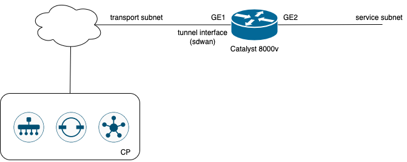

# Catalyst 8000v deployment on VMWare vSphere

Deployment of the c8kv on vSphere with basic onfiguration and onboarding in the SDWAN CP

The scripts will deploy and onboard a Catalyst 8000V on vSphere using existing networks. Following items will be created:

- Single C8000v instance with a transport interface and a service interface. Basic configuration to connect to an existing SD-WAN Fabric.

The scripts will create a new c8kv instance from an existing template. Creating the template from the Catalyst 8000v ISO image can be done using the provided packer script.

## Create the template using packer

Using the [vSphere packer plugin](https://github.com/hashicorp/packer-plugin-vsphere) the scripts will create a template based on the c8kv iso image.

- Go to image directory
- Edit variables.json with appropriate settings.

The iso_url can be a local file or a remote URL.

With image as your current working directory, run packer:

    packer build -var-file ./variables.json .

NOTE:  Due to a bug in the vsphere packer plugin (v 1.0.4) the script is not able to detect when the instance is booted and has connectivity, so for now we use the "none" communicator and ask for a manual shutdown of the VM before is transformed in a template.

## Create c8000v in vSphere

The 2 needed networks - transport and service - are expected to already exist. Also be sure to have the necessary cloud-init file under the cloud-init directory - use the provided ansible script under GenerateCloudInit to generate it.

Deploy Cisco SD-WAN C8000v in the VPC network:

- Go to cedge directory
- Edit variables.auto.tfvars.json with appropriate settings.

The complete list of input variables:

- name: name of the deployed instance
- vsphere_server: hostname of the vSphere server
- vsphere_user: vSphere username
- vsphere_password: vSphere password
- datacenter: datacenter to use
- cluser
- datastore
- folder - folder where to create the instance (can be empty)
- template - name of the c8kv template
- vm_num_cpus - number of vcpus for the created instance
- vm_memory - amount of memory for the created instance
- subnet_transport - name of the subnet to be used for the transport interface
- subnet_service: name of the subnet to be used for the service interface

Terraform deployment:

    terraform init
    terraform plan
    terraform apply

## Termination

To terminate c8000v instances, go to the cedge directory and run:

    terraform destroy --auto-approve
